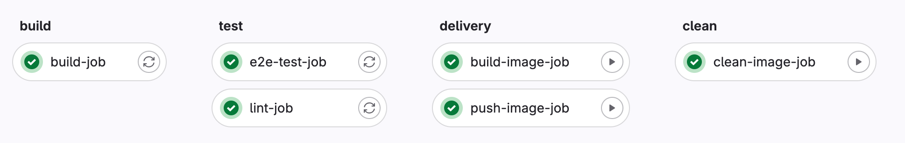
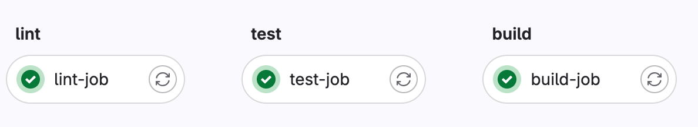

## The Twelve-Factor App
✅ — требования выполняются

❌ — требования **не** выполняются

⬜ — требования не к чему выполнить ~~отсутствует состав преступления~~

### 1. Кодовая база

В проекте есть две кодовые базы — [бэкенд](https://gitlab.teamdev.huds.su/bivi/backend) и [мобильное приложение](https://gitlab.teamdev.huds.su/bivi/mobileapp), обе лежат на нашем гитлабе.

*"If there are multiple codebases, it is not an app — it is a distributed system.Each component in a distributed system is an app, and each can individually comply with twelve-factor."*

Пу-пу-пу.... Ну ничего, будем рассматривать каждый элемент нашей ✨системы✨.

Два наших компонента **не** ссылаются на один и тот же код, что является плюсом.
Что касается множественного деплоя, то он реализован, но не явно, так как у нас не было задачи развертывания. Но есть джоба для пуша образа в наш реджистри, куда мы кладем как тестовые образы, так и продовые. 

||Бэкенд| Мобильное приложение|
|---|:-:|:-:|
|Кодовая база|✅|✅|

### 2. Зависимости

Все нужные зависимости для бэкенда, начиная от библиотек для разработки и заканчивая пакетами для визуализации тестов, явно указываются в файле [go.mod](https://gitlab.teamdev.huds.su/bivi/backend/-/blob/main/go.mod?ref_type=heads).

Все нужные зависимости для мобильного приложения аналогично явно задаются в файле [Package.resolved](https://gitlab.teamdev.huds.su/bivi/mobileapp/-/blob/main/bivi/bivi.xcodeproj/project.xcworkspace/xcshareddata/swiftpm/Package.resolved?ref_type=heads).

||Бэкенд| Мобильное приложение|
|---|:-:|:-:|
| Зависимости |✅ |✅|

### 3. Конфигурация

Для бэкенда есть отдельная [папка](https://gitlab.teamdev.huds.su/bivi/backend/-/tree/main/env?ref_type=heads) с конфигами для приложения. Также часть параметров, которые относятся не к приложению, а к окружению, на котором собираются образы, указаны в [мейкфайле](https://gitlab.teamdev.huds.su/bivi/backend/-/blob/main/makefile?ref_type=heads#L4-5).

Для мобильного приложения нет необходимости конфигурировать [один](https://gitlab.teamdev.huds.su/bivi/mobileapp/-/blob/main/bivi/bivi/Sources/Infrastructure/Endpoint.swift#L21) параметр в отдельном файле.

||Бэкенд| Мобильное приложение|
|---|:-:|:-:|
| Конфигурация |✅| ❌ |

### 4. Сторонние службы

Для работы самих приложений у нас отсутствуют хранилища данных, системы очередей и кэширования ([отключено](https://gitlab.teamdev.huds.su/bivi/backend/-/blob/main/internal/pkg/app/fiber_app.go?ref_type=heads#L62) даже на уровне кода), с которыми происходит общение по сети. 

Видеоконтент для бэкенда берется из вольюмов или файлового хранилища. По сети общается бэкенд и мобильное приложение, танцев с бубном для организации их общения нет, потому что люди придумали API.

Что касается деплоя, то registry для образов подменяется через гитлаб и никак не связано с приложением.

||Бэкенд| Мобильное приложение|
|---|:-:|:-:|
| Сторонние службы |✅|✅|

### 5. Сборка, релиз, выполнение

У нас есть красивый пайплайн для бэкенда:

И не менее красивый для мобильного приложения:

Выполнение отсутвует, так как мы бедные студенты и не арендовали сервак, чтобы оно где-то крутилось.
Есть реестр [релизов](https://gitlab.teamdev.huds.su/bivi/backend/container_registry) для бэкенда, в качестве ID был выбран хэш коммита.

Таким образом, все стадии, которые есть у нас — логически разделены.

||Бэкенд| Мобильное приложение|
|---|:-:|:-:|
| Сборка, релиз, выполнение| ✅ (есть сборка и релиз)| ✅ (есть сборка)|

### 6. Процессы

Состояния не сохраняем. Честно 🫡. Разделяемых данных тоже нет.

||Бэкенд| Мобильное приложение|
|---|:-:|:-:|
| Процессы | ✅ (stateless)| ✅ (stateless)|

### 7. Привязка портов

Спасибо, что мы используем докер и можем написать -p и прокинуть нужные порты. А для их указания используем конфиг, см. пункт 3.

||Бэкенд| Мобильное приложение|
|---|:-:|:-:|
| Порты | ✅ | ⬜ (порты не используются) |

### 8. Параллелизм

Смаштабировать путем запуска нескольких контейнеров бэкенда мы можем, ибо бэкенд это один процесс с многопоточностью внутри.

Что касается мобильного приложения, то:
- для каждого конкретного мобильного приложения создается 1 процесс;
- взаимодействие с UI происходит на главном потоке;
- запросы на бэкенд вне главного потока.

||Бэкенд| Мобильное приложение|
|---|:-:|:-:|
| Параллелизм | ✅ (эх щас бы запустить все в k8s) | ✅ (одному айфону по одному приложению) |

### 9. Утилизируемость

Так как бэкенд запускается в докере, то его запуск и остановка реализуется [однострочниками](https://gitlab.teamdev.huds.su/bivi/backend#%D0%B7%D0%B0%D0%BF%D1%83%D1%81%D0%BA-%D0%BF%D1%80%D0%B8%D0%BB%D0%BE%D0%B6%D0%B5%D0%BD%D0%B8%D1%8F).
У нас нет очередей и нет фоновых задач.
Что касается graceful shutdown и SIGTERM, то такой механизм [реализован](https://gitlab.teamdev.huds.su/bivi/backend/-/blob/main/cmd/app/main.go#L51) для бэкенда.

Мобильное приложение сложно оценить, кажется, что этот пункт больше про бэкенд, но очередей и фоновых задач нет.

||Бэкенд| Мобильное приложение|
|---|:-:|:-:|
| Утилизируемость | ✅ |  ⬜ (тут просто можно выйти из приложения, почистить вкладки айфона и зайти нормально) |

### 10. Паритет окружений разработки и продуктива

Так как все запускается локально, то у нас отсутствует тестовое и продовое окружение.

- Различие во времени: отсутствует, разработчик сразу же может работать с кодом, который попадет в прод.
- Различие персонала: присутствует.
- Различие инструментов: разработка идет на разных осях, но для унификации используется докер.

Что касается мобильного приложение под iOS, то его в докере не запустишь и на андроиде тоже. Но зато окружения тем более не различаются.

С одной стороны у нас явно не реализованы разные окружения из-за отсутствия необходимости, но с другой стороны, есть все для их реализации (запуск в докере и сборка образов под конкретную архитектуру, наличие программистов и администраторов).

Считаю, что ❌ в этом пункте должен означать невыполнение, но в нашем случае это отсутствие, поэтому ⬜.
||Бэкенд| Мобильное приложение|
|---|:-:|:-:|
| Паритет окружений разработки и продуктива | ⬜ | ⬜ |

### 11. Журналирование

Логи по работе приложения бэкенда пишутся в stdout, поэтому мы получаем их через логи контейнера.

На мобильном клиенте есть логирование: логи кладутся в локальный файл, файловая система iOS устроена так, что этот файлик нельзя просто так посмотреть с айфона. Поэтому реализована отправка логов на бекенд по [ручке](https://gitlab.teamdev.huds.su/bivi/mobileapp/-/blob/main/bivi/bivi/Sources/Infrastructure/Endpoint.swift#L33). Логи кладутся папочку logs, указываемую в [конфиге](https://gitlab.teamdev.huds.su/bivi/backend/-/blob/main/env/app.local.yaml?ref_type=heads#L5).

||Бэкенд| Мобильное приложение|
|---|:-:|:-:|
| Журналирование | ✅ | ✅|

### 12. Задачи администрирования

Отсутствуют! Если не считать запуск контейнера для бэкенда или установки приложения на мобильный телефон.
||Бэкенд| Мобильное приложение|
|---|:-:|:-:|
| Задачи администрирования | ⬜  | ⬜ |

---
### Итог
#### Вы тоже заметили как количество текста коррелирует с номером пункта, да?

|Итог|Кодовая база|Зависимости| Конфигурация| Сторонние службы | Сборка, релиз, выполнение | Процессы |  Привязка портов |  Параллелизм | Утилизируемость | Паритет окружений разработки и продуктива | Журналирование | Задачи администрирования |
|---|:-:|:-:|:-:|:-:|:-:|:-:|:-:|:-:|:-:|:-:|:-:|:-:|
| Бэкенд |✅| ✅| ✅ | ✅| ✅ (2/3) | ✅ | ✅ | ✅ | ✅| ⬜ | ✅ | ⬜ |
 Мобильное приложение| ✅ |✅ |❌|  ✅ |  ✅ (1/3) |  ✅ |  ⬜  | ✅| ⬜| ⬜ |✅  | ⬜  |
